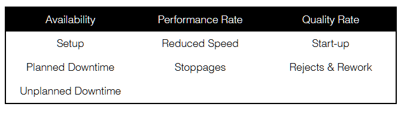

Overall Equipment Effectiveness (OEE) is a key performance indicator for quantifying the utilization of manufacturing equipment. OEE is the product of availability, performance rate and quality rate of product for that piece of equipment.

No piece of equipment can operate indefinitely at its design speed and with no rejected material. It may experience unplanned downtime (a failure) or require periodic maintenance as planned downtime. It may not even be scheduled to run such as for operator non-working time or holidays. These are availability measures.

A piece of equipment is designed to operate at an ideal run rate or design speed as units of good product produced per period of time (e.g. cans/hour). Actual performance can be above or below this rate. These are performance rate measures.

Equipment never produces 100% good product for an extended period of time. The rejected units reduce the yield. These are quality rate measures. Each rejected unit can be measured as lost production time. For example, if the equipment is designed to produce 1 unit per minute, and one unit is rejected, that is 1 minute of lost time.
​
Kennedy in his book Understanding, Measuring, and Improving Overall Equipment Effectiveness, defines seven losses affecting OEE during the equipment’s running time. These losses are:

In addition to these seven OEE loss categories, the following two categories determine the available running time of the equipment:
1. Not scheduled
2. Unscheduled

Therefore there are nine time loss categories:
1. **Not Scheduled**: this is non-working time. Non-working periods (e.g. holidays) typically are planned in the work schedule that is assigned to the equipment.
2. **Unscheduled**: working time when the equipment is not scheduled for normal production (e.g. a pilot or laboratory test run).
3. **Planned Downtime**: working time when the equipment is not scheduled for normal production but the activity is intended to support production (e.g. planned preventive maintenance).
4. **Unplanned Downtime**: working time when the equipment is not available due to an unexpected fault (e.g. motor failure or jam). The event is considered a failure for the purposes of calculating the Mean Time Between Failures (MTBF).
5. **Setup**: working time when the equipment is being changed over in order to run new material or a new lot of the same material.
6. **Stoppages**: minor or short periods of time when the equipment is not producing as expected (such as a blocked or starved condition).
7. **Reduced Speed**: the equipment is producing, but not at its design speed or ideal run rate
8. **Rejects & Rework**: product that was rejected from the equipment for not meeting quality acceptance criteria
9. **Start-up**: product that was used in setting up the equipment and cannot be considered as “good” output.

Every minute over the total duration of the measurement period (TOTAL) will fall into one of the above nine time loss categories or be in the Value Adding Time (VAT). Equipment with a high VAT, has a high OEE. Therefore, the goal is to maximize the Value Adding time.

The total measurement period can be divided up as follows:
1. **Required Operations Time (ROT)**: TOTAL - Not Scheduled
2. **Available Time (AT)**: ROT - Unscheduled
3. **Scheduled Production Time (SPT)**: AT - Planned Downtime
4. **Production Time (PT)**: SPY - Setup
5. **Reported Production Time (RPT)**: PT - Unplanned Downtime
6. **Net Production Time (NPT)**: PT - Stoppages
7. **Efficient Net Production Time (ENPT)**: NPT - Reduced Speed
8. **Effective Net Producton Time (EFNPT)**: ENPT - Rejects & Rework
9. **Value Adding Time (VAT)**: EFNPT - Start-up
​
From these nine time buckets we can calculate OEE from its three components. Availability is RPT/AT, performance rate is ENPT/RPT and quality rate is VAT/ENPT. OEE is the product of these three fractions and is equal to VAT/AT.
​
This time-loss model has been implemented by Point 85 in a suite of software applications. To learn more about these applications, please see the <a href="impl/index.html">Implementation</a> page.

<a href="index.html">Return to top</a>

---

