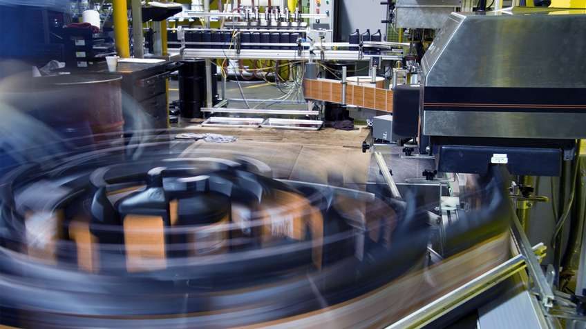

---
# Feel free to add content and custom Front Matter to this file.
# To modify the layout, see https://jekyllrb.com/docs/themes/#overriding-theme-defaults
# Welcome to my website! Check out my [blog](/blog/) for the latest posts.

# 

layout: home
title: Point85 Rev. 16
---

<h2>Tabs</h2>

Click on the buttons inside the tabbed menu:

  <button class="tablinks" onclick="openCity(event, 'London')">London</button>
  <button class="tablinks" onclick="openCity(event, 'Paris')">Paris</button>
  <button class="tablinks" onclick="openCity(event, 'Tokyo')">Tokyo</button>

  <h3>London</h3>
  
London is the capital city of England.

  <h3>Paris</h3>
  
Paris is the capital of France.
 

  <h3>Tokyo</h3>
  
Tokyo is the capital of Japan.

<h1>GeeksforGeeks</h1>
<h2>GeeksforGeeks</h2>
<h3>GeeksforGeeks</h3>
<h4>GeeksforGeeks</h4>
<h5>GeeksforGeeks</h5>
<h6>GeeksforGeeks</h6>

# PDF Reference Example

<a href="https://github.com/point85/OEE-Designer/blob/master/docs/Point85 OEE Getting Started Guide.pdf" target="_blank">Download Getting Started Guide</a>

<a href="resources/files/Santa Margarita.zip">Download Santa Margarita</a>

# My Images

# Font Size Example

This is a paragraph with a larger font size.

This is a smaller text.

## With Div

  This text is larger.

  This text is smaller.

# Table with Different Font Sizes

<table>
  <tr>
    <th>Item</th>
    <th>Description</th>
  </tr>
  <tr>
    <td>Large Text</td>
    <td>This text is larger.</td>
  </tr>
  <tr>
    <td>Small Text</td>
    <td>This text is smaller.</td>
  </tr>
  <tr>
    <td>Medium Text</td>
    <td>This text is medium-sized.</td>
  </tr>
</table>

# Image Gallery

| System |  |
|-------|-------------|
|  | **Overall Equipment Effectiveness**   Overall Equipment Effectiveness (OEE) is a key performance indicator for quantifying the utilization of manufacturing equipment. OEE is the product of availability, performance rate and quality rate for materials produced by that equipment. For more information, see the Introduction.|
|  | Description for Image 2 |

Overall Equipment Effectiveness
 
 Overall Equipment Effectiveness (OEE) is a key performance indicator for quantifying the utilization of manufacturing equipment. OEE is the product of availability, performance rate and quality rate for materials produced by that equipment. For more information, see the Introduction.|

---

# Image with Text Overlay

  
  

    <h1>Point85</h1>
  

# Dropdown Menu Example

  <button class="dropbtn">Menu</button>
  

    <a href="index.html">Home</a>
    <a href="about.html">About</a>
    <a href="blog.html">Blog</a>
    <a href="contact.html">Contact</a>
  

